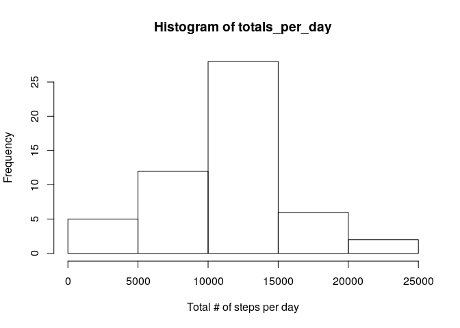
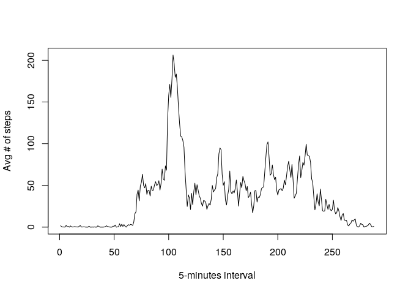
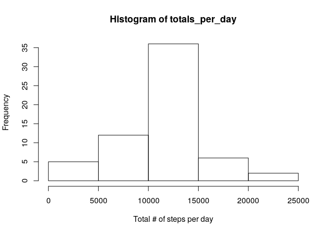
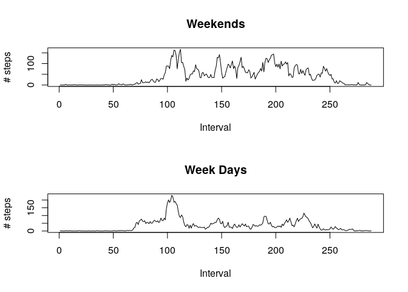

# Reproducible Research: Peer Assessment 1
Fred DUBRU  
30 June 2017  


## Loading and preprocessing the data
* Load the data from 'read.csv' file downloaded from coursera web site.
* Convert 'date' strings to 'Date' objects

```r
df <- read.csv("~fred/MEGAsync/training/coursera/Reproducible Research/Week2/Assessment/activity.csv")
df$date <- as.Date(as.character(df$date), format = "%Y-%m-%d")
```

## What is mean total number of steps taken per day?
For this part of the assignment, we have ignored the missing values in the dataset. With the code follolwing we:

* calculate the total number of steps taken per day
* make a histogram of the total number of steps taken each day
* Calculate and report the mean and median of the total number of steps taken per day

```r
df2 <- na.omit(df)
totals_per_day <- tapply(X = df$steps, df$date, sum)
hist(totals_per_day, xlab = "Total # of steps per day")
```

<!-- -->

```r
summary(totals_per_day)
```

```
##    Min. 1st Qu.  Median    Mean 3rd Qu.    Max.    NA's 
##      41    8841   10760   10770   13290   21190       8
```
Median of the total number of steps is **10760** and the mean is **10770** 

## What is the average daily activity pattern?
* Time series plot of the 5-minute interval and the average number of steps taken, averaged across all days

```r
five_interv <- tapply(X = df2$steps, df2$interval, mean)
plot(five_interv, type = "l", ylab = "Avg # of steps", xlab = "5-minutes interval")
```

<!-- -->

* On average across all the days in the dataset, the following 5-minutes interval contains the maximum number of steps

```r
names(which(five_interv==max(five_interv)))
```

```
## [1] "835"
```

## Imputing missing values
Note that there are a number of days/intervals where there are missing values (coded as NA). 

* Total number of missing values in the dataset:

```r
sum(is.na(df))
```

```
## [1] 2304
```

```r
    summary(totals_per_day)
```

```
##    Min. 1st Qu.  Median    Mean 3rd Qu.    Max.    NA's 
##      41    8841   10760   10770   13290   21190       8
```

* Filling in startegy: we used the mean of the 5-minutes interval. We create a new dataset that is equal to the original dataset but with the missing data filled in.

```r
    # Use mean of the interval to subsitute NAs
    df3 <- df
    na_rows <- which(is.na(df3))
    for(i in na_rows){
        df3$steps[i] <- five_interv[which(names(five_interv)==df3$interval[i])]
    }
```

* Histogram of the total number of steps taken per day with new data set

```r
    totals_per_day <- tapply(X = df3$steps, df3$date, sum)
    hist(totals_per_day, xlab = "Total # of steps per day")
```

<!-- -->

* We can see that in this case, subtituting the missing values with the 5 minutes interval average does not significantly change the mean and average of the total number of steps per day:

```r
    summary(totals_per_day)
```

```
##    Min. 1st Qu.  Median    Mean 3rd Qu.    Max. 
##      41    9819   10770   10770   12810   21190
```

## Are there differences in activity patterns between weekdays and weekends?

* Create a new factor variable in the dataset with two levels – “weekday” and “weekend” indicating whether a given date is a weekday or weekend day:

```r
df4 <- df3
df4$WE <- factor(weekdays(df4$date))
levels(df4$WE) <- list("weekend" = c("Saturday", "Sunday"),
                        "weekday" = c("Monday", "Tuesday", "Wednesday",
                                         "Thursday", "Friday"))
```


```r
weekdays <- subset(df4, WE=="weekday")
weekends <- subset(df4, WE=="weekend")
summary_weekdays <- tapply( weekdays$steps, weekdays$interval,mean)
summary_weekdends <- tapply( weekends$steps, weekends$interval,mean)

par(mfrow=c(2,1))
plot(summary_weekdends, type = "l", ylab = "# steps", xlab = "Interval", main="Weekends")
plot(summary_weekdays, type = "l", ylab = "# steps", xlab = "Interval", main="Week Days")
```

<!-- -->
